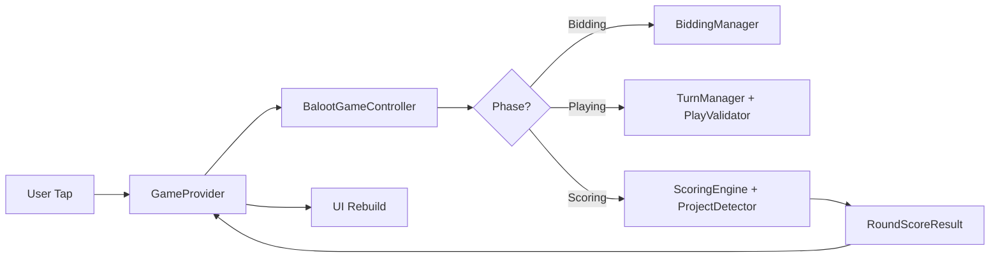
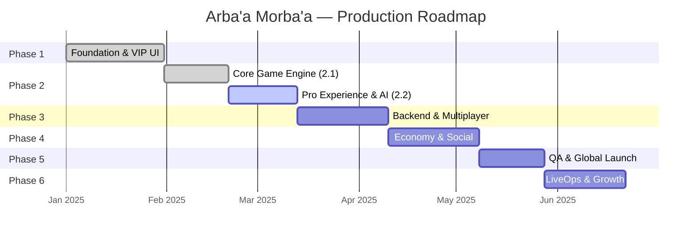

<div align="center">

# 🃏 Arba'a Morba'a — أربعة مربعة

### *The Premier Professional Baloot Platform*

[](https://flutter.dev)
[](https://dart.dev)
[]()
[]()
[]()

---

*A tournament-grade Baloot card game engineered to rival market leaders like **Kammelna** and **Jawaker**.*
*Built with a Security-First architecture, 100% rulebook fidelity, and a sustainable business ecosystem.*

</div>

---

## 📋 Table of Contents

- [Overview](#-overview)
- [Key Features](#-key-features)
- [Architecture](#-architecture)
- [Tech Stack](#-tech-stack)
- [Project Structure](#-project-structure)
- [Game Engine](#-game-engine)
- [Getting Started](#-getting-started)
- [Development Roadmap](#-development-roadmap)
- [Testing](#-testing)
- [Contributing](#-contributing)
- [License](#-license)

---

## 🌟 Overview

**Arba'a Morba'a** (أربعة مربعة) is a premium, enterprise-grade Baloot card game platform designed to deliver a flawless, professional gaming experience. Every rule, animation, and scoring calculation has been meticulously validated against the official **Kammelna / Jawaker** rulebooks to ensure 100% fidelity with professional Saudi Baloot standards.

The platform targets the **152-point classic game mode** with full support for:

- **Hakam** (حكم) and **Sun** (صن) game modes
- **Ashkal** (أشكال) dealer/sane bidding
- **Projects** (مشاريع): Sera, 50, 100, 400, and Baloot
- **Escalation**: Double → Triple → Four → Gahwa
- **Professional penalties**: Qaid violations and Project Stealing

---

## ✨ Key Features

### 🎮 Game Engine
| Feature | Description |
|---------|-------------|
| **100% Rulebook Fidelity** | Every bid, play, and score validated against Kammelna/Jawaker standards |
| **Smart AI Opponents** | Rule-based bot engine with strategic bidding and card play |
| **Real-Time Project Detection** | Automatic scanning of hands for Sera, 50, 100, 400 during the deal phase |
| **Complementary Scoring** | Drift-proof math ensuring round totals always equal 162 (Hakam) or 130 (Sun) |
| **Jawaker-Style Rounding** | Precise `.5 rounds DOWN, .6+ rounds UP` scoreboard conversion |
| **Professional Penalties** | Qaid violation detection with instant Kabout-score penalties |
| **Project Stealing** | Rule 14.4 — defenders steal buyer's project points on Khams |

### 🎨 Premium UI/UX
| Feature | Description |
|---------|-------------|
| **VIP Visual Identity** | Gold/Obsidian theme with custom Tajawal typography |
| **3D Majlis Table** | Hand-painted carpet perspective with ambient lighting |
| **Cinematic Card Animations** | Deal arcs, trick throws, and collection sweeps at 60 FPS |
| **Responsive Design** | Pixel-perfect rendering from Samsung A06 to iPhone 15 Pro Max |
| **Bilingual Support** | Full Arabic (RTL) and English localization |

### 🔐 Architecture
| Feature | Description |
|---------|-------------|
| **Feature-First Architecture** | Clean separation of concerns for long-term scalability |
| **Modular Engine Design** | Independent modules for dealing, bidding, playing, and scoring |
| **State Management** | Provider-based reactive UI with immutable game state models |
| **Comprehensive Logging** | Kammelna-style score breakdowns for transparent rule verification |

---

## 🏗 Architecture

The application follows a **Feature-First Clean Architecture** pattern, ensuring separation of concerns and long-term maintainability.

```
┌─────────────────────────────────────────────────┐
│                 PRESENTATION                     │
│  GameProvider → GameTableScreen → Widgets        │
├─────────────────────────────────────────────────┤
│                   DOMAIN                         │
│  BalootGameController (Orchestrator)             │
│  ┌──────────┐ ┌──────────┐ ┌──────────────────┐ │
│  │  Deck    │ │ Bidding  │ │ Turn             │ │
│  │ Manager  │ │ Manager  │ │ Manager          │ │
│  └──────────┘ └──────────┘ └──────────────────┘ │
│  ┌──────────┐ ┌──────────┐ ┌──────────────────┐ │
│  │ Scoring  │ │ Project  │ │ Bot              │ │
│  │ Engine   │ │ Detector │ │ Engine           │ │
│  └──────────┘ └──────────┘ └──────────────────┘ │
│  ┌──────────────────────────────────────────────┐│
│  │           Play Validator                     ││
│  └──────────────────────────────────────────────┘│
├─────────────────────────────────────────────────┤
│                    DATA                          │
│  CardModel · RoundStateModel · CardPlayModel     │
├─────────────────────────────────────────────────┤
│                    CORE                          │
│  Theme · L10n · Constants · Interfaces · Utils   │
└─────────────────────────────────────────────────┘
```

### Data Flow



---

## 🛠 Tech Stack

| Layer | Technology | Purpose |
|-------|-----------|---------|
| **Framework** | Flutter 3.x | Cross-platform UI (iOS, Android, Web) |
| **Language** | Dart 3.x | Type-safe, null-safe application logic |
| **State** | Provider | Reactive UI state management |
| **Typography** | Google Fonts (Tajawal) | Premium Arabic/Latin typography |
| **Animations** | animate_do | Micro-animations and transitions |
| **Localization** | flutter_localizations + intl | Full AR/EN bilingual support |
| **Graphics** | flutter_svg | Scalable vector assets |
| **Testing** | flutter_test | Unit and widget testing |

---

## 📁 Project Structure

```
lib/
├── main.dart                          # App entry point & provider setup
├── core/
│   ├── constants/                     # Asset paths, app-wide constants
│   ├── errors/                        # Custom exception classes
│   ├── interfaces/                    # IBalootController abstract contract
│   ├── l10n/                          # Arabic/English game translations
│   ├── layout/                        # Responsive layout utilities
│   ├── providers/                     # Locale and theme providers
│   ├── theme/                         # Gold/Obsidian VIP theme system
│   ├── utils/                         # GameLogger, helpers
│   └── widgets/                       # Shared reusable widgets
├── data/
│   └── models/
│       ├── card_model.dart            # Card suits, ranks, strength, points
│       ├── card_play_model.dart       # Card + player index for tricks
│       └── round_state_model.dart     # Immutable round state snapshot
└── features/
    ├── dashboard/                     # Home screen & navigation shell
    ├── game/
    │   ├── domain/
    │   │   ├── baloot_game_controller.dart  # Master game orchestrator
    │   │   ├── engines/
    │   │   │   ├── bot_engine.dart          # AI opponent logic
    │   │   │   ├── project_detector.dart    # Sera/50/100/400/Baloot scanner
    │   │   │   └── scoring_engine.dart      # Points, Khams, Kabout math
    │   │   ├── managers/
    │   │   │   ├── bidding_manager.dart     # Mzad (auction) state machine
    │   │   │   ├── deck_manager.dart        # Shuffle, Kut, 2-phase deal
    │   │   │   └── turn_manager.dart        # Trick flow & winner evaluation
    │   │   └── validators/
    │   │       └── play_validator.dart      # Legal move enforcement
    │   └── presentation/
    │       ├── game_provider.dart           # UI state bridge
    │       ├── game_table_screen.dart       # Main game screen
    │       └── widgets/
    │           ├── playing_card.dart        # Card face/back renderer
    │           ├── player_seat_widget.dart  # Opponent card fans & avatars
    │           ├── human_hand_widget.dart   # Player's interactive hand
    │           ├── scoring_overlays.dart    # Round-end score breakdown
    │           ├── project_sheet.dart       # Project declaration UI
    │           └── ...                      # 8 more specialized widgets
    ├── session/                        # Game session management
    ├── settings/                       # User preferences
    └── splash/                         # Animated splash screen
```

---

## 🧠 Game Engine

### Module Breakdown

#### 🃏 DeckManager
Manages the 32-card Baloot deck lifecycle:
- **Create** → Standard 32-card deck (7 through Ace, 4 suits)
- **Shuffle** → Fisher-Yates randomization
- **Kut (Cut)** → Randomized deck split before dealing
- **Deal Phase 1** → 3 + 2 cards per player, 1 buyer card revealed
- **Deal Phase 2** → Remaining 3 cards per player after bidding

#### 🎤 BiddingManager
Full Mzad (مزاد) state machine per Kammelna rules:
- **Round 1**: Hakam (buyer card suit) or Pass
- **Round 2**: Sun, Second Hakam (different suit), or Pass
- **Ashkal**: Special Sun bid available only to Dealer and Sane
- **Sawa**: Defending team accepts the active bid
- **Confirmation**: Hakam buyer chooses to confirm or switch to Sun

#### ⚔️ TurnManager
Manages the 8-trick round flow:
- Card play validation and trick collection
- Winner evaluation (highest trump > highest lead suit)
- Abnat accumulation with +10 ground bonus on Trick 8
- Kabout detection (all 8 tricks won by one team)

#### 📊 ScoringEngine
Tournament-grade scoring mathematics:
- **Sun Formula**: `round(abnat / 10) × 2` (total always = 26)
- **Hakam Formula**: Jawaker rounding (`.5↓ .6↑`) with complementary scoring (total always = 16)
- **Khams (Sweep)**: Buyer fails threshold → defenders get base score (26 Sun / 16 Hakam)
- **Kabout**: All 8 tricks → 44 Sun / 25 Hakam (× Ace multiplier × Double multiplier)
- **Project Stealing**: On Khams, defenders receive buyer's project points (Rule 14.4)
- **Qaid Penalty**: Illegal play → instant round loss with Kabout-base award

#### 🔍 ProjectDetector
Scans 8-card hands for professional projects:
- **Sera** (سرا): 3 consecutive same suit → 20 Abnat / 2 pts
- **Fifty** (خمسين): 4 consecutive same suit → 50 Abnat / 5 pts
- **Hundred** (مئة): 5 consecutive OR 10-J-Q-K same suit → 100 Abnat / 10 pts
- **Four Hundred** (أربعمئة): 4 Aces in Sun mode → 400 Abnat / 40 pts
- **Baloot** (بلوت): K+Q of trump (auto-declared on 2nd card play)
- **Rule 14.1 Tie-Breaking**: Trump sequence wins; otherwise turn-order proximity

#### 🤖 BotEngine
Strategic AI opponent with contextual decision-making:
- **Bidding**: Hand strength evaluation for Hakam/Sun/Pass decisions
- **Playing**: Trick-position awareness, partner card tracking, trump management
- **Double**: Defensive hand evaluation for escalation decisions

---

## 🚀 Getting Started

### Prerequisites

- **Flutter SDK** ≥ 3.0.0
- **Dart SDK** ≥ 3.0.0
- **Android Studio** or **VS Code** with Flutter extensions
- Physical device or emulator (Android / iOS)

### Installation

```bash
# Clone the repository
git clone https://github.com/your-org/arba4-morba4.git
cd arba4-morba4

# Install dependencies
flutter pub get

# Run on connected device
flutter run

# Run on web (preview)
flutter run -d chrome

# Build release APK
flutter build apk --release
```

### Environment Setup

```bash
# Verify Flutter installation
flutter doctor

# Enable web support (optional)
flutter config --enable-web
```

---

## 🗺 Development Roadmap

### Phase Overview



---

### ✅ Phase 1 — Foundation & VIP UI `COMPLETED`

> Clean Feature-First Architecture, VIP Visual Identity, and Core UI Templates.

- [x] Feature-First Flutter architecture for long-term scalability
- [x] VIP Gold/Obsidian theme with custom Tajawal typography
- [x] Home Screen, Lobby, and Navigation framework
- [x] Live web preview for stakeholder review

---

### ✅ Phase 2.1 — Core Game Engine & Logic `COMPLETED`

> The "Brain" of the game — 100% rulebook fidelity with Kammelna standards.

| Module | Description | Status |
|--------|-------------|--------|
| **Advanced Dealer System** | Shuffle, Kut, 2-phase dealing, auto project detection | ✅ Done |
| **Turn & Timeout Management** | Player sequences, trick evaluation, Kabout detection | ✅ Done |
| **Bidding & Modes** | Sun, Hakam, Ashkal, Second Hakam, Sawa, Confirmation | ✅ Done |
| **Rulebook & Validation** | Legal move enforcement, Qaid violations, project priority | ✅ Done |
| **Scoring & State** | Complementary scoring, Khams/Kabout, project stealing | ✅ Done |

---

### 🔄 Phase 2.2 — Pro Experience & AI Engine `IN PROGRESS`

> Premium visual experience, AI opponents, and offline play capability.

| Module | Description | Status |
|--------|-------------|--------|
| **VIP Game Table** | 3D Majlis table, custom card sprites, high-res UI | ✅ Done |
| **UX & Animations** | Card-throwing arcs, trick transitions, Kammelna polish | ✅ Done |
| **Advanced AI Engine** | 3 difficulty levels (Easy, Medium, Hard) | 🔄 In Progress |
| **Offline & Practice** | Local game loop without internet | 🔄 In Progress |
| **Voice & Audio** | Arabic/English voice-overs and immersive SFX | ⬚ Planned |

---

### ⬚ Phase 3 — Backend & Multiplayer Infrastructure `PLANNED`

> Secure, un-hackable, real-time multiplayer with authoritative server validation.

| Module | Description | Duration |
|--------|-------------|----------|
| **Socket.io Core** | Real-time bi-directional communication layer | 4 Days |
| **Matchmaking & Rooms** | Dynamic room management and player grouping | 5 Days |
| **Authoritative Logic** | Server-side rule validation (Anti-Cheat) | 6 Days |
| **Redis State & Sync** | Sub-millisecond state storage, instant reconnection | 4 Days |
| **Security & Auth** | JWT authentication and session management | 3 Days |
| **DevOps & Scaling** | Docker containerization, Nginx load balancing | 3 Days |
| **Stress Testing** | 1,000+ concurrent player simulation | 3 Days |

**Technologies**: Node.js · Socket.io · Redis · MongoDB · Docker · Nginx

---

### ⬚ Phase 4 — Social Ecosystem & Monetization `PLANNED`

> Player retention, community features, and revenue generation.

| Module | Description | Duration |
|--------|-------------|----------|
| **User Economy** | Coin/Gem balances with secure transaction logging | 4 Days |
| **VIP Store** | IAP integration for skins, avatars, and VIP membership | 5 Days |
| **Global & Room Chat** | Real-time Socket.io chat with moderation | 5 Days |
| **Leagues & Ranks** | Bronze → Legend tier system with weekly leaderboards | 5 Days |
| **Social & Friends** | Add Friend, private room invitations, activity status | 3 Days |
| **Daily Rewards** | Daily Spin / login rewards for DAU retention | 3 Days |
| **UI Polish** | Shop, Community, and Trophy tab finalization | 3 Days |

---

### ⬚ Phase 5 — Quality Assurance & Global Launch `PLANNED`

> The "Zero-Glitch" guarantee across all mobile hardware.

| Module | Description | Duration |
|--------|-------------|----------|
| **Cross-Device QA** | Physical iPhone/Android testing for SafeArea/notch | 4 Days |
| **Performance Tuning** | 60 FPS optimization on mid-range devices | 3 Days |
| **Network Stress Test** | Server latency and stability validation | 3 Days |
| **Bug Squashing** | Edge-case and UI glitch cleanup | 3 Days |
| **Store Assets** | Professional screenshots and marketing copy | 2 Days |
| **Beta Launch** | TestFlight (iOS) and Google Play Beta deployment | 3 Days |
| **Official Submission** | Apple App Store and Google Play review management | 2 Days |

---

### ⬚ Phase 6 — LiveOps & Global Growth `PLANNED`

> Long-term business management, analytics, and content delivery.

| Module | Description | Duration |
|--------|-------------|----------|
| **Admin Dashboard** | MERN-based web portal for user and economy management | 5 Days |
| **Live Monitoring** | Automated alerts for server health and uptime (99.9%) | 3 Days |
| **Analytics Integration** | Firebase/Mixpanel for retention and monetization tracking | 4 Days |
| **LiveOps Content** | Hot-loading seasonal themes and content without app updates | 5 Days |
| **Customer Support** | In-app reporting and automated ticketing system | 3 Days |
| **Optimization Cycle** | Post-launch patch cycle based on real user feedback | 5 Days |

---

## 🧪 Testing

### Unit Tests

```bash
# Run all tests
flutter test

# Run specific test suite
flutter test test/game/project_detector_test.dart

# Run with coverage
flutter test --coverage
```

### Current Test Coverage

| Module | Tests | Status |
|--------|-------|--------|
| ProjectDetector | 16 test cases | ✅ All Passing |
| Scoring Engine | Manual log verification | ✅ Verified |
| Bidding Manager | Integration tested | ✅ Verified |
| Play Validator | Integration tested | ✅ Verified |

### Game Log Verification

The engine produces a detailed **Kammelna Score Breakdown** after every round for transparent rule verification:

```
[22:48:09] Round Score Added -> Team A: +2, Team B: +36
[22:48:09] --- KAMMELNA SCORE BREAKDOWN ---
[22:48:09]   Buyer: Seat 3 (Team B)
[22:48:09]   Mode: HAKAM, Double: doubled
[22:48:09]   Outcome Reason: normal
[22:48:09]   Trick Abnat (Cards): A=27, B=135
[22:48:09]   Ground Bonus (+10): Team B
[22:48:09]   Project (Team B): sera (20 Abnat)
[22:48:09]   Project Priority Winner: Team B
[22:48:09]   Effective Project Abnat (After Priority/Stealing): A=0, B=20
[22:48:09]   Baloot Declared: Team A (+2 Scoreboard Pts)
```

---

## 👥 Contributing

This is a **proprietary project** developed for Arba'a Morba'a by **Abdul Sami**. Contributions are managed internally.

### Development Standards

- **Dart Analysis**: Zero warnings policy (`flutter analyze`)
- **Code Style**: Follow existing patterns — Feature-First architecture
- **Documentation**: All engine modules must include JSDoc-style comments
- **Testing**: New scoring/rule logic must include unit tests
- **Git**: Conventional commits (`feat:`, `fix:`, `refactor:`, `docs:`)

---

## 📄 License

**Proprietary** — All rights reserved.
This software is the intellectual property of the Arba'a Morba'a project stakeholders. Unauthorized copying, distribution, or modification is strictly prohibited.

---

<div align="center">

**Built with ❤️ by Abdul Sami**

*Engineered to rival Kammelna. Designed to exceed expectations.*

🃏 ♠️ ♥️ ♦️ ♣️

</div>
